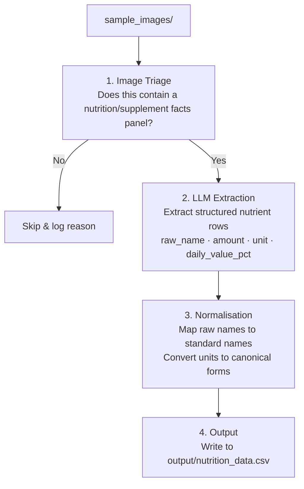

# Submission Plan -- Nutrition Label Parser

## Observations from the Sample Images

After reviewing all 13 images, several things stand out:

| Image | Product | What's on it | Notes |
|---|---|---|---|
| product_01.png | MindGuard Nootropic Brain Formula | Supplement Facts panel | Dark background, low contrast |
| product_02.png | Ancient+Brave Vital & Active | Back label, text-heavy, no clear table | Ingredients in paragraph form |
| product_03.png | Ancient+Brave Brave Immunity | Nutrition Information table (EU-style) | Mushroom extracts, Vitamin C, clean table |
| product_04.png | Ancient+Brave Brave Immunity | **Front of box -- no nutrition data** | Must detect and skip |
| product_05.png | Ancient+Brave Brave Immunity | **Back with directions -- no nutrition table** | Must detect and skip |
| product_06.png | ProMix Raw Greens | **Front of pouch -- no nutrition data** | Must detect and skip |
| product_07.jpg | Together Health Women's Multi | Dense paragraph-style product info with NRV% | Not a table -- nutrients embedded in running text |
| product_08.jpg | Together Health Women's | **Front of pouch -- no nutrition data** | Must detect and skip |
| product_09.png | ProMix Raw Greens | Nutritional Information table | Detailed, clean, two-column (Per Serving + %NRV) |
| product_10.png | MindGuard Nootropic | Supplement Facts (side/rotated view) | Same product as 01, different angle |
| product_11.png | Omega-3 softgel | Nutritional Information table | Omega-3 fatty acid breakdown, clean |
| product_12.png | Omega-3 softgel (same product) | Fancy graphical nutrition layout | Same data as 11, but circular infographic style |
| product_13.png | NordHerz Omega-3 | **German-language** Nährwerte label | Non-English label |

### Key challenges identified

1. **Not all images contain nutrition data** -- 4 of 13 are front/back panels with no parseable info (04, 05, 06, 08)
2. **Format variety** -- standard tables, EU-style tables, paragraph text (07), graphical infographics (12)
3. **Low contrast / dark backgrounds** -- products 01, 10 have white-on-dark text
4. **Non-English labels** -- product 13 is in German
5. **Duplicate products at different angles** -- 01/10 are the same product, 03/04/05 are the same product, 11/12 are the same product
6. **Supplement vs. food nutrition labels** -- different conventions (Supplement Facts vs. Nutrition Facts vs. Nutrition Information)
7. **Exotic nutrients** -- nootropic blends, mushroom extracts, omega-3 sub-types that don't map to a simple standard name

---

## Architecture Plan

### Approach: Vision LLM as the core extraction engine

Rather than building a traditional OCR -> text parsing -> regex pipeline, I'll use a **multimodal LLM (Claude's vision API)** as the primary extraction engine. This is the right call because:

- The label formats are wildly inconsistent -- regex/heuristic parsing would require dozens of format-specific rules
- Vision models handle dark backgrounds, rotated text, and graphical layouts natively
- A single well-crafted prompt can handle extraction + initial normalisation in one pass
- The 13-image scale makes API cost negligible

The LLM handles the "messy understanding" part; deterministic Python code handles the "clean normalisation" part.

### Pipeline



### Module breakdown

```
source_code/
  __init__.py
  main.py              # CLI entrypoint: process folder -> CSV
  pipeline.py           # Orchestrates the 4 stages
  extractor.py          # Stage 1+2: LLM-based image triage + nutrient extraction
  normaliser.py         # Stage 3: nutrient name + unit normalisation
  models.py             # Pydantic data models (NutrientRow, ExtractionResult)
  nutrient_map.py       # Static mapping: raw names -> standard names
  config.py             # Settings (API keys, model, paths)
```

### Schema decisions

I'll extend the suggested schema slightly:

| Column | Type | Rationale |
|---|---|---|
| `product_image` | str | Source filename |
| `nutrient_name_raw` | str | Exactly as it appeared on the label |
| `nutrient_name_standard` | str | Normalised identifier (e.g. `vitamin_c`) |
| `amount` | float | Numeric value per serving |
| `unit` | str | Normalised unit (`mg`, `g`, `ug`, `IU`, `kcal`) |
| `daily_value_pct` | float \| null | %DV / %NRV if present on label |
| `serving_size` | str | e.g. "1 scoop (8.5g)", "1 capsule" -- per image, not per row, but denormalized for simplicity |
| `confidence` | str | `high` / `medium` / `low` -- LLM's self-assessed confidence |

**Why `daily_value_pct`?** Most labels include it, it's useful for downstream analysis, and dropping it loses real information.

**Why `serving_size` denormalized?** It's a property of the label, not the nutrient. But putting it on every row makes the CSV self-contained -- no joins needed. The alternative (a separate products table) is overengineering for 13 images.

**Why `confidence`?** The LLM sometimes guesses on blurry text. A confidence flag lets downstream consumers filter.

---

## Normalisation Strategy

### Nutrient name mapping

I'll build a **static dictionary** covering the nutrients visible in these 13 images, plus common aliases. Roughly 60-80 entries. Examples:

```python
NUTRIENT_MAP = {
    "vitamin c": "vitamin_c",
    "ascorbic acid": "vitamin_c",
    "thiamine": "vitamin_b1",
    "thiamine mononitrate": "vitamin_b1",
    "riboflavin": "vitamin_b2",
    "pyridoxine hcl": "vitamin_b6",
    "epa": "epa",
    "dha": "dha",
    "eicosapentaenoic acid": "epa",
    # ... etc
}
```

For nutrients that don't match the map (e.g. proprietary blends like "Synephrine Adaptogenics"), the standard name will be set to the snake_case version of the raw name. This is an intentional design choice -- **it's better to pass through an un-mapped name than to silently drop it or force a bad mapping**.

### Unit normalisation

Simple and deterministic:

```python
UNIT_MAP = {
    "milligrams": "mg", "milligram": "mg",
    "grams": "g", "gram": "g",
    "micrograms": "ug", "microgram": "ug", "mcg": "ug",
    "iu": "IU",
    "kcal": "kcal", "calories": "kcal", "cal": "kcal",
    "kj": "kJ",
    "ml": "mL",
}
```

### What I will NOT normalise

- **Unit conversions** (e.g. IU -> mg for vitamin D). These are nutrient-specific and lossy. The label said IU, we store IU.
- **German -> English translation** of nutrient names. Product 13 is in German. I'll extract raw names in German but attempt standard mapping where obvious (e.g. "Fischol" -> fish_oil). Non-obvious ones pass through in German snake_case.
- **Proprietary blend sub-components**. If a label says "Nootropic Blend 500mg" with sub-items, I'll extract the sub-items individually but won't try to infer amounts that aren't stated.

---

## Handling the Hard Parts

### 1. Images with no nutrition data (products 04, 05, 06, 08)

The LLM triage step asks: "Does this image contain a nutrition/supplement facts panel or table?" If not, it's logged and skipped. No rows are emitted. This is preferable to hallucinating data.

### 2. Paragraph-style labels (product 07)

Product 07 lists nutrients in running text: "Vitamin D: 10ug (200%), Vitamin E: 2.5mg..." -- This is still extractable by the LLM; it just isn't in a table. The prompt will handle both tabular and inline formats.

### 3. Graphical/infographic layouts (product 12)

Product 12 presents the same omega-3 data as product 11 but in a circular infographic. The LLM vision model can read this. If extraction confidence is low, the confidence field captures that.

### 4. Duplicate products (01/10, 11/12)

I will NOT deduplicate. Each image is processed independently. If the consumer wants to deduplicate, they can do that downstream. Deduplication requires product identity resolution, which is a separate (hard) problem.

### 5. Non-English labels (product 13)

The LLM can read German. Raw names will be in German, standard names will be mapped where possible. This is a pragmatic choice -- building a full multilingual normalisation layer is out of scope for 4-6 hours.

---

## What I'm choosing NOT to build

| Feature | Why not |
|---|---|
| OCR preprocessing (binarisation, deskewing) | The LLM vision model handles this natively. Adding Tesseract/EasyOCR would add complexity with marginal benefit at this small scale. Would be a good idea to consider if I were to have a larger set and more compatible with OCR. |
| Product identity / deduplication | Hard problem (same product, different angle). Not asked for. Each image stands alone. |
| Full multilingual support | Only one German label. LLM handles it well enough. A proper i18n nutrient DB is just additional work. |
| IU/mcg/mg cross-conversion | Nutrient-specific conversion factors, risk of errors, and the label's original unit is more faithful. |
| Database storage | CSV is the asked-for output. A DB adds infra for no benefit at this scale. |
| Web UI | Not asked for. CLI is sufficient. |
| Async/parallel processing | 13 images, ~2s each. Sequential is fine. Would add parallelism at 100+ images. |
| Retry/error recovery | Simple try/except with logging. No need for a job queue or circuit breaker at this scale. |

---

## What I'd do next with more time

1. **Validation layer** -- Compare extracted data against known reference values (e.g. FDA nutrient database) to flag outliers
1. **Integrity layer** -- Use [instructor](https://python.useinstructor.com/) to force compliance of LLM outputs
1. **Product deduplication** -- Use image similarity + extracted data overlap to group images of the same product
1. **Comprehensive nutrient ontology** -- Replace the flat dict with a proper ontology (e.g. mapping to USDA NDB numbers)
1. **Evaluation harness** -- Manually label 5-10 images as ground truth, compute precision/recall per field
1. **Batch parallelism** -- async API calls for processing hundreds of images
1. **Caching** -- Hash images and cache extraction results to avoid re-processing
1. **Cost controls** -- Token counting and budget limits for the LLM API

---

## Tech stack

- **Python 3.11+** (matches the existing project setup)
- **Claude API (claude-sonnet-4-6)** -- vision model for extraction. Sonnet is the sweet spot: fast, cheap, excellent vision.
- **Pydantic** -- structured output models
- **Standard library CSV** -- output writing
- **pytest** -- unit tests for the normalisation layer
- **uv** -- dependency management (already set up)
- **Claude Code** -- to help with documentation, model creation, improving the extractor and unit tests

